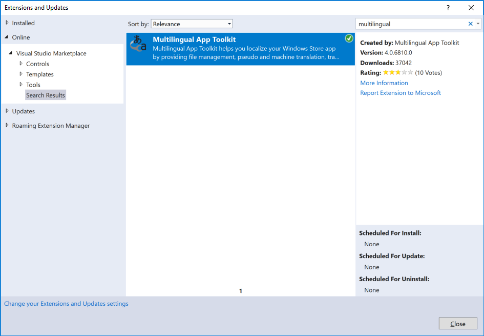

# How To Use Multilingual App Toolkit (MAT) for RESX localization

## Install MAT

The first step is to download and install MAT 4.0 from https://marketplace.visualstudio.com/items?itemName=MultilingualAppToolkit.MultilingualAppToolkit-18308 (or directly from Visual Studio by using Tools->Extensions and Updates.



Once MAT is installed, you will have a new menu item under your Tools menu - "Mutlilingual App Toolkit". 


You will use that menu to enable MAT in new projects. You should not need to use it unless you are adding a new project to LibMan (or starting a completely different product/project). 

## Enable MAT in your projects (already done for LibMan)

Prior to enabling MAT, you need 

1. Add Properties\AssemblyInfo.cs if it doesn't exist in your project already
2. Add ```[assembly: NeutralResourcesLanguage("en")]``` entry to the AssemblyInfo.cs

If you don't do that, you'll get ```Project 'Microsoft.Web.LibraryInstaller.Contracts' was not enabled - the project's source culture could not be determined.``` in the Multilingual App Toolkit output window.

Once you've done the steps above, select the desired project in the Solution Explorer and use Tools->Multilingual App Toolkit->Enable Selection to enable MAT in the selected project. 


It will modify your csproj file to add something like
```
  <PropertyGroup Label="MultilingualAppToolkit">
    <MultilingualAppToolkitVersion>4.0</MultilingualAppToolkitVersion>
    <MultilingualFallbackLanguage>en</MultilingualFallbackLanguage>
    <TranslationReport Condition="'$(Configuration)' == 'Release'">true</TranslationReport>
    <SuppressPseudoWarning Condition="'$(Configuration)' == 'Debug'">true</SuppressPseudoWarning>
  </PropertyGroup>
```

and

```
  <Target Name="MATPrerequisite" BeforeTargets="PrepareForBuild" Condition="!Exists('$(MSBuildExtensionsPath)\Microsoft\Multilingual App Toolkit\Microsoft.Multilingual.ResxResources.targets')" Label="MultilingualAppToolkit">
    <Warning Text="$(MSBuildProjectFile) is Multilingual build enabled, but the Multilingual App Toolkit is unavailable during the build. If building with Visual Studio, please check to ensure that toolkit is properly installed." />
  </Target>
```

Make sure to save your csproj at this point. You are done enabling MAT for this project. Repeat for other projects as needed. You can also run it on the solution level.

**Troubleshooting:** Look in the Output Window, and Make sure Multilinguage App Toolkit is selected. If all goes well, you should get 

```
1>  Project 'Microsoft.Web.LibraryInstaller.Contracts' was enabled.  The project's source culture is 'en' [English]. 
```


If something goes wrong, you may get an error. Google is your friend in that case.


## Add Translation Languages

Once you have MAT enabled, adding translation languages is the next step. At this point, you should have a new context menu item when you select your project in Solution Explorer - Multilingual App Toolkit. Select that, and then select Add Translation Languages:


You might get an error message like below


Click OK to dismiss it. You should get the following dialog for language selection


Use it to select the desired languages. Start with German (de). You can use the Search box to type in the language name or abbreviation as shown above. Once German is shown, make sure to check its checkbox and click OK. You will get MultilingualResources folder added to your project, and your first XLF file for German translation generated from the RESX file in your project:


You will also get new German RESX file generated as well:


Now you can bring your Add Translation Languages dialog again and finish adding all languages (cs, de, es, fr, it, ja, ko, pl, pt-BR, ru, tr, zh-Hans, zh-Hant). You can add them all at once, without dismissing the dialog. At the end, your project should look something like this:


Check in the modified project into the loc branch in Git. At this point your project is ready for loc team vendors to pick up the XLF files.

## (Optional) Machine-Translate Generated XLF files

One of the nice features of XLF is that they can be machine-translated. Simply drop the generated XLF file(s) to 

\\kimkim60\BlackBox\Hackathon\Service-CE\DROP\[your alias]\[culture] (e.g. \\kimkim60\BlackBox\Hackathon\Service-CE\DROP\alexgav\ru)

wait a minute or two, and pick them up from 

\\kimkim60\BlackBox\Hackathon\Service-CE\PICKUP\[your alias]\[culture] (e.g. \\kimkim60\BlackBox\Hackathon\Service-CE\PICKUP\alexgav\ru)

You should see translated text in the picked up XLF file. Normally vendors will manually go over the translated text and fix it up as needed. 

## (Optional) Update project XLF files with translated XLF files

Normally this step is done by the loc team, but it's great to make sure that your setup is working correctly.

In your project, select the XLF file to update (e.g. somefile.ru.xlf) and use Multilingual App Resources context menu in Solution Explorer to execute ```Import/Recycle Translations...``` command. That will bring up the following dialog


Click Add, then navigate to the translated XLF file (e.g. Russian translation if you selected "filename.**ru**.xlf"). 

## (Optional) Update project XLF files with translated XLF files
