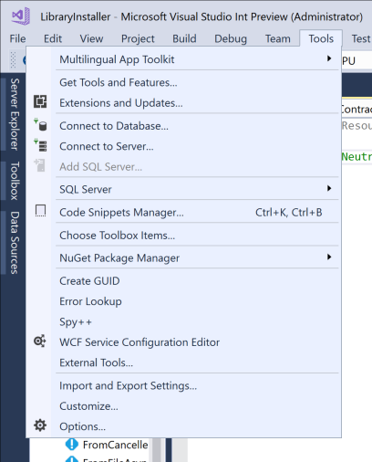

# How To Use Multilingual App Toolkit (MAT) for RESX localization

## Install MAT

The first step is to download and install MAT 4.0 from https://marketplace.visualstudio.com/items?itemName=MultilingualAppToolkit.MultilingualAppToolkit-18308 (or directly from Visual Studio by using Tools->Extensions and Updates.


Once MAT is installed, you will have a new menu item under your Tools menu - "Mutlilingual App Toolkit". 



You will use that menu to enable MAT in new projects. You should not need to use it unless you are adding a new project to LibMan (or starting a completely different product/project). 

## Enable MAT in your projects (already done for LibMan)

Prior to enabling MAT, you need 

1. Add Properties\AssemblyInfo.cs if it doesn't exist in your project already
2. Add ```[assembly: NeutralResourcesLanguage("en")]``` entry to the AssemblyInfo.cs

If you don't do that, you'll get ```Project 'Microsoft.Web.LibraryInstaller.Contracts' was not enabled - the project's source culture could not be determined.``` in the Multilingual App Toolkit output window.

Once you've done the steps above, select the desired project in the Solution Explorer and use Tools->Multilingual App Toolkit->Enable Selection to enable MAT in the selected project. 

